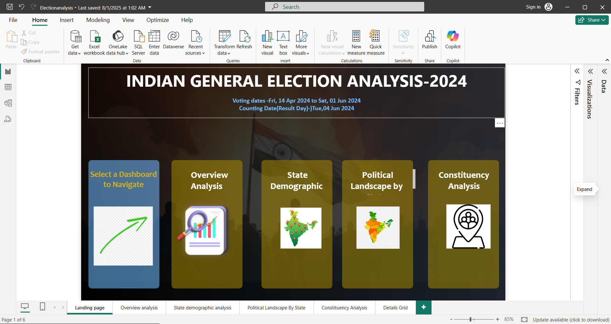

# India-election-analysis-2024

# 🗳️ Power BI Project: Indian General Election Analysis

## 📝 Description

This Power BI project provides an analytical view of Indian General Election results across multiple constituencies. It highlights party-wise performance, candidate-wise rankings, vote share distributions, and geographical trends based on the election data.

---

## 🗂️ File Contents

| File Name                         | Description                                      |
|----------------------------------|--------------------------------------------------|
| `election_analysis.pbix`         | Main Power BI report file                        |
| `constituencywise_details.csv`   | Dataset with candidate-level vote data           |
| `constituencywise_results.csv`   | Aggregated constituency-level results            |
| `partywise_results.csv`          | Party-level performance summary                  |
| `screenshots/`                   | Report page screenshots                          |
| `README.md`                      | This documentation file                          |

---

## 📊 Key Insights

- 🥇 Top-performing parties and candidates by vote count
- 🥈 Identification of runner-up and second runner-up candidates
- 🗺️ Regional strongholds of major political parties
- ⚖️ Vote share analysis across constituencies
- 🔍 Drill-through filters for candidate and party details

---

## ⚙️ Tools & Techniques Used

- **Power BI Desktop**
- **DAX** for dynamic measures (e.g., RankX, LookupValue)
- **Power Query (M)** for data transformation
- **Custom Tooltips** and **Drill-through** pages
- **Stacked bar charts, maps, slicers, and KPI visuals**

---

## 🖼️ Report Screenshots

### 📌Landing Page

### 🧑‍🤝‍🧑 Candidate Rankings by Constituency

### 🌍 Regional Heat Map of Results

---

## 📁 Data Source

- **Election Commission of India** (mock data or scraped for demo)
- Format: `.csv`
- Note: All data used in this project is for educational and non-commercial use.

---

## 🚀 How to Use

1. Clone or download this repository.
2. Open `election_analysis.pbix` using [Power BI Desktop](https://powerbi.microsoft.com/)
3. Ensure the CSV files are in the same directory or update data source paths.
4. Explore report pages, use slicers for filters, and hover over visuals for tooltips.

---

## 👩‍💻 Author

**Fathima Nourin**  
